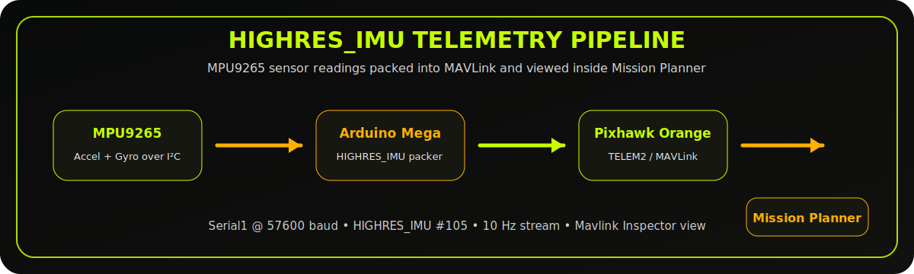
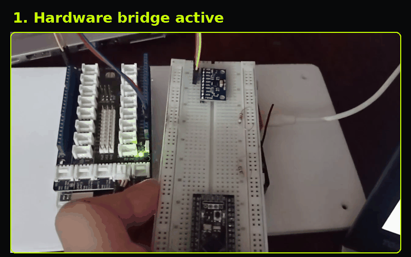
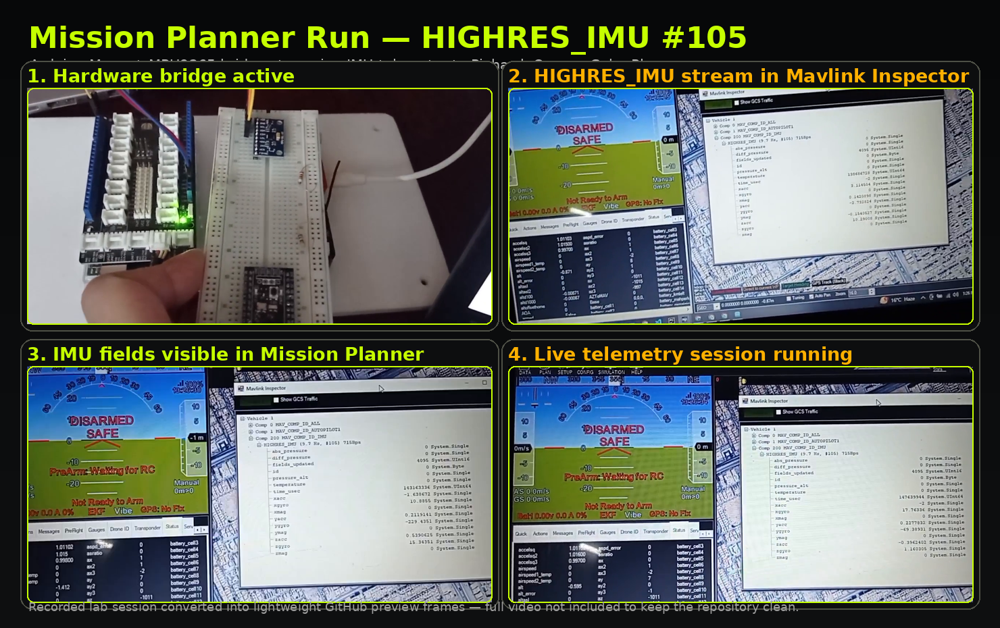

# Arduino Mega → Pixhawk HIGHRES_IMU Bridge

<p align="center">
  
</p>

<p align="center">
  
  
  
  
</p>

A clean embedded-systems project for sending **high-resolution IMU telemetry** from an **Arduino Mega** to a **Pixhawk Orange Cube Plus** through MAVLink.

The project includes two working paths:

- **Simulated HIGHRES_IMU stream** for controlled testing.
- **MPU9265 → Arduino Mega → Pixhawk bridge** for live accelerometer and gyroscope readings.

The output can be checked in **Mission Planner → Mavlink Inspector**, where the `HIGHRES_IMU (#105)` message stream and sensor fields appear live.

---

## Mission Planner Run

<p align="center">
  
</p>

<p align="center">
  
</p>

The recorded lab session was converted into lightweight GitHub preview assets instead of uploading the full video. The session shows the hardware link active, Mission Planner connected, and the `HIGHRES_IMU (#105)` stream visible inside Mavlink Inspector.

---

## System Flow

```text
MPU9265 IMU Sensor
      │  I²C
      ▼
Arduino Mega
      │  MAVLink HIGHRES_IMU @ 57600 baud
      ▼
Pixhawk Orange Cube Plus / TELEM2
      │
      ▼
Mission Planner / Mavlink Inspector
```

---

## What This Project Shows

| Area | Detail |
|---|---|
| Message type | `HIGHRES_IMU` / MAVLink message ID `105` |
| Sensor path | MPU9265 readings collected by Arduino Mega over I²C |
| Communication | Arduino Mega `Serial1` to Pixhawk TELEM2 |
| Telemetry rate | 10 Hz message transmission in the included sketches |
| Mission Planner view | `xacc`, `yacc`, `zacc`, `xgyro`, `ygyro`, `zgyro`, `xmag`, `ymag`, `zmag`, `temperature`, `time_usec` |
| Use case | External/custom IMU telemetry experiments with Pixhawk and MAVLink |

---

## Hardware

| Component | Role |
|---|---|
| Arduino Mega | Reads sensor data and sends MAVLink messages |
| Pixhawk Orange Cube Plus | Receives MAVLink telemetry on TELEM2 |
| MPU9265 | External IMU sensor for accelerometer and gyroscope readings |
| Mission Planner | Configuration and telemetry inspection |
| Jumper wires / TELEM cable | UART connection between Arduino and Pixhawk |

---

## Wiring

### Pixhawk TELEM2 ↔ Arduino Mega

| Pixhawk TELEM2 | Arduino Mega |
|---|---|
| TX | RX1 / Pin 19 |
| RX | TX1 / Pin 18 |
| GND | GND |

### MPU9265 ↔ Arduino Mega

| MPU9265 | Arduino Mega |
|---|---|
| SDA | SDA / Pin 20 |
| SCL | SCL / Pin 21 |
| VCC | 3.3V / according to sensor module rating |
| GND | GND |

> UART is crossed: Pixhawk TX goes to Arduino RX, and Pixhawk RX goes to Arduino TX.

---

## Mission Planner Parameters

| Parameter | Value | Purpose |
|---|---:|---|
| `SERIAL2_BAUD` | `57600` | TELEM2 communication speed |
| `SERIAL2_PROTOCOL` | `MAVLink1` | Enables MAVLink on TELEM2 |
| `AHRS_EKF_TYPE` | `3` | Uses EKF3 |
| `EK3_ENABLE` | `1` | Enables EKF3 |
| `EK3_IMU_MASK` | Based on setup | Selects IMU usage for EKF3 |

---

## Repository Structure

```text
ArduinoMega-Pixhawk-HIGHRES-IMU-Bridge/
│
├── README.md
├── HIGHRES_IMU_Communication_Report.md
├── STEP_BY_STEP_SETUP.md
├── .gitignore
│
├── src/
│   ├── Arduino_Mega_HIGHRES_IMU_Simulator.ino
│   └── Arduino_Mega_MPU9265_HIGHRES_IMU_Bridge.ino
│
├── assets/
│   ├── highres-imu-pipeline.svg
│   ├── mission-planner-highres-imu-run.gif
│   ├── mission-planner-highres-imu-session.png
│   └── mission-planner-highres-imu-session-small.png
│
└── examples/
    └── mission_planner_run_notes.md
```

---

## Arduino Sketches

### 1. Simulated HIGHRES_IMU Transmitter

```text
src/Arduino_Mega_HIGHRES_IMU_Simulator.ino
```

Use this first when the goal is to check the serial link, MAVLink packing, and Mission Planner message stream with controlled values.

### 2. MPU9265 HIGHRES_IMU Bridge

```text
src/Arduino_Mega_MPU9265_HIGHRES_IMU_Bridge.ino
```

This sketch reads accelerometer and gyroscope values from the MPU9265, converts them into MAVLink-friendly units, packs them into `HIGHRES_IMU`, and sends the serialized packet to Pixhawk through `Serial1`.

---

## Quick Start

1. Connect Arduino Mega `Serial1` to Pixhawk TELEM2.
2. Connect MPU9265 to Arduino Mega through I²C.
3. Configure Mission Planner parameters.
4. Upload the simulator sketch first.
5. Open **Mission Planner → Mavlink Inspector**.
6. Look for:

```text
HIGHRES_IMU (#105)
```

7. Upload the MPU9265 bridge sketch when the simulated stream is working.

---

## Notes

- The simulator sketch is useful for checking the pipeline before using live sensor data.
- The MPU9265 version currently focuses on accelerometer and gyroscope values.
- Magnetometer, pressure, and temperature fields can be extended depending on the final sensor stack.
- The vehicle can remain disarmed while the telemetry stream is inspected.

---

## Future Upgrades

- Add MPU9265 magnetometer support.
- Add external barometer/temperature integration.
- Add configurable message rate.
- Add SD-card logging for outgoing MAVLink frames.
- Compare Arduino-sent IMU values against Pixhawk onboard IMU values.
- Add a Python MAVLink listener for PC-side logging.

---

## Tech Stack

```text
Arduino Mega • MPU9265 • Pixhawk Orange Cube Plus • MAVLink • Mission Planner • Embedded C/C++ • UART • I²C
```
